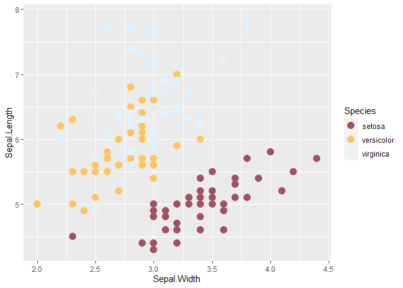
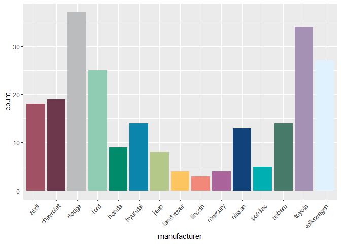

<!-- README.md is generated from README.Rmd. Please edit that file -->

# sciColours

sciColours is a package containing the corporate colour schemes of SCIF.

## Installation

You can install the released version of sciColours from
[GitHub](https://github.com/) with:

``` r
# install.packages("devtools")
devtools::install_github("gronert-m/sciColours")
```

## Basic use examples

``` r
library(sciColours)
library(ggplot2)

# sci_pal requires to select the palette (default is "main")  followed by the number of colours 
sci_pal()(2)
#> [1] "#A05163" "#DFF2FD"
sci_pal(palette= "main")(2)
#> [1] "#A05163" "#DFF2FD"
sci_pal(palette= "secondary")(3)
#> [1] "#A05163" "#0D83AF" "#785DA4"

# scale_colour_sci can be added to the ggplot object
ggplot(iris, aes(Sepal.Width, Sepal.Length, colour = Species)) +
  geom_point(size = 4) +
  sciColours::scale_colour_sci()
```



``` r

# same for scale_fill_sci
ggplot(mpg, aes(manufacturer, fill = manufacturer)) +
    geom_bar() +
    theme(axis.text.x = element_text(angle = 45, hjust = 1)) +
    scale_fill_sci(palette = "main", guide = "none")
```


